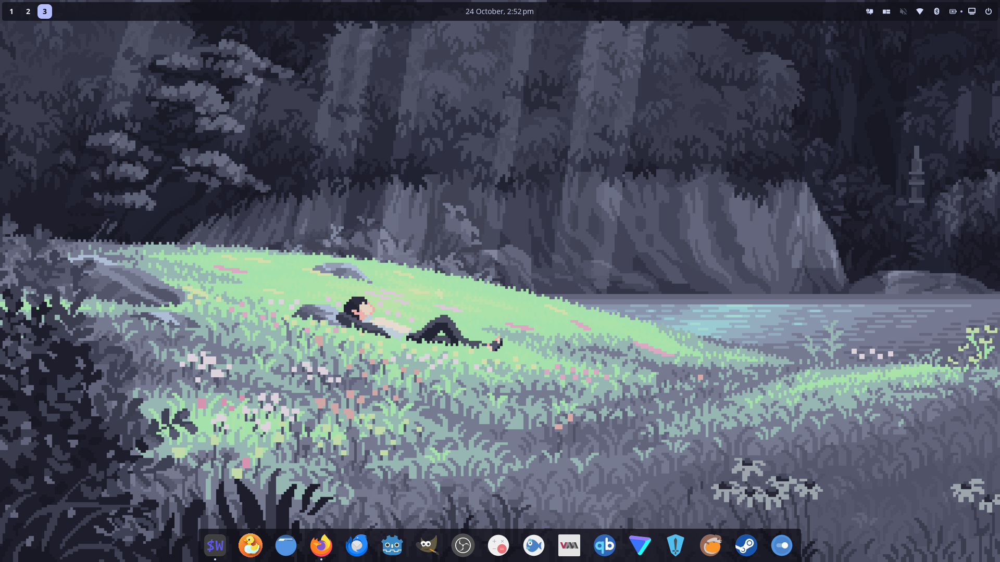
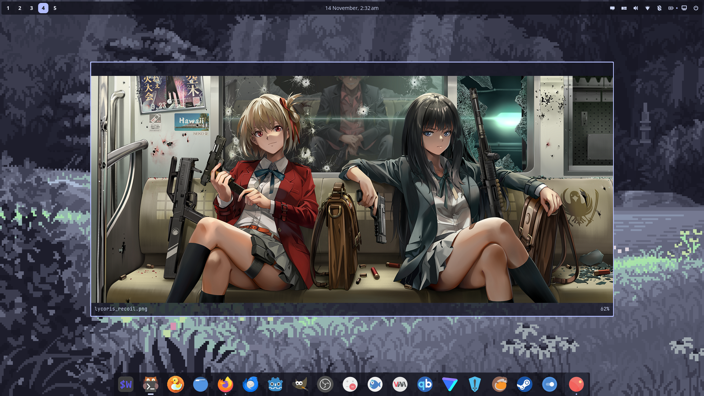
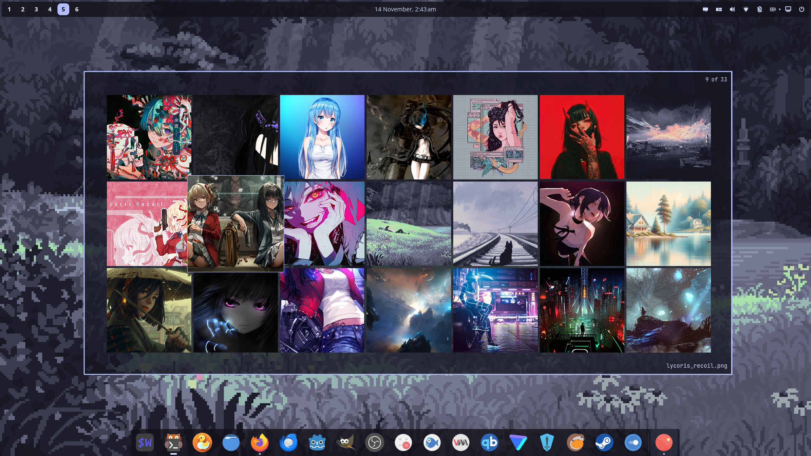

<h1 align="center"> Dotfiles </h1>

<p align="center">
<!-- NixOS (Blue) -->


<!-- Home Manager (Sky) -->


<!-- Cosmic DE (Lavender) -->


<!-- Helix (Mauve) -->


<!-- Yazi (Blue) -->


<!-- Yazi (Pink) -->

</p>

<p align="center"> Welcome to my Nix Dotfiles, a configuration using Home Manager, featuring the COSMIC desktop, Catppuccin theme, and essential development tools. </p>

## Screenshots

### Cosmic DE



### Fastfetch


<details>
  <summary>More Screenshots</summary>

### Zellij


### Helix with Yazi


### Helix with Lazygit


### Helix


### Helix with Gemini


### Tiles


### Bottom


### Cosmic Files and Nautilus


### Firefox


### Firefox with vertical tabs


### Nwg-drawer


### Rofi


### Swayimg



### Swayimg Gallery



</details>

## Installation

### TLDR: I do not provide a magical script to transform your NixOS to mimic my config. Copy the individual program config from `home/` directory and configure/modify it according to your own liking.

## Project Structure

```.
├── home/
│   ├── default.nix        # Home manager specific config
│   ├── cosmic/            # Cosmic DE config (not nixified)
│   ├── helix/             # Helix editor config
│   ├── yazi/              # Yazi terminal file manager config
│   ├── zellij/            # Zellij TUI multiplexer config
│   └── ...                # Other Home Manager modules
├── system/                # System-level NixOS config
│   ├── configuration.nix
│   └── virtualisation.nix
├── flake.nix
└── README.md
```

## Home Manager

This configuration uses Home Manager as a Nix module (instead of running a standalone home-manager CLI setup). Home Manager declaratively manages the user environment: packages, dotfiles, and user services in a reproducible way.

## Helix as IDE

This setup features deep integration of Helix with Zellij, Yazi, and Lazygit:

- **Helix**: The ~~post modern~~ _stable_ editor whose plugins don’t crash every other day because it doesn’t need 50 of them (or any) to be useful in the first place. All language configurations are managed in `home/helix/language.nix` for:
    - Rust, C, C++, Nix, Lua, Typst, Python, Bash, Dockerfile, Docker Compose, JavaScript, TypeScript, JSX, TSX, JSON, YAML, Markdown, HTML, CSS, SCSS, Svelte, TOML, PowerShell
    - Most of the language is configured with formatters and language servers.
- **Yazi**: Integrated as a file picker within Helix.
- **Lazygit**: Integrated as the Git UI inside Helix.
- **Zellij**: tHe InTEgRRattion: Used to open Yazi and Lazygit in floating panes, making them appear as native Helix popups for a unified workflow.
- **LLM Integration**: Gemini is integrated for AI-assisted tasks, available through floating Zellij panes. Note that this can be configured to work with any cli tool. Just edit the scripts in `./home/helix/default.nix`.

> [!note]
> There's no LLM based autocompletion setup. I dislike those tools, and this Gemini is mostly for generatin commit messages and README files. If you want copilot like completion, look for `helix-gpt`.

Keybindings for LLM features:

- `space + l + a`: Analyze the code and suggest improvements.
- `space + l + c`: Open a chat session with Gemini.
- `space + l + e`: Explain the selected codebase.
- `space + l + m`: Generate a commit message based on the current changes.

Yazi and Lazygit are launched in context aware floating panes via Zellij, making them feel like native extensions of Helix. This tight integration allows seamless file navigation and Git operations without ever leaving the editor environment.

## Credits & Acknowledgments

This configuration is built upon the excellent work of the following projects and their maintainers:

**[NixOS](https://nixos.org/)** - The Nix Operating System that enables reproducible and declarative system configurations.

**[Cosmic DE](https://system76.com/cosmic)** - Customizable, and performant desktop environment built from scratch using Rust and the Iced toolkit.

**[Home Manager](https://github.com/nix-community/home-manager)** - Nix-based user environment configurator by the nix-community, enabling declarative management of user packages and dotfiles.

**[Helix](https://helix-editor.com/)** - The ~~post modern~~ _stable_ editor whose plugins don’t crash every other day because it doesn’t need 50 of them (or any) to be useful in the first place.

**[Zellij](https://zellij.dev/)** - A terminal workspace with batteries included.

**[Yazi](https://github.com/sxyazi/yazi)** - Blazing fast terminal file manager by sxyazi, written in Rust with async I/O.

**[Kitty](https://github.com/kovidgoyal/kitty)** - A fast, feature-rich, GPU-based terminal emulator.

**[Rofi](https://github.com/davatorium/rofi)** - An application launcher and dmenu replacement.

**[Nwg-drawer](https://github.com/nwg-piotr/nwg-drawer)** - A GTK3-based application drawer for wlroots-based Wayland compositors. However this works in my smithay based COSMIC de rather well.

**[Catppuccin](https://github.com/catppuccin/catppuccin)** - Soothing pastel theme ecosystem maintained by the Catppuccin organization, providing consistent theming across multiple applications.

**[Starship](https://starship.rs/)** - Cross-shell prompt by the Starship contributors, providing a fast and customizable command line prompt.

**[LazyGit](https://github.com/jesseduffield/lazygit)** - Simple terminal UI for git commands by jesseduffield, providing an intuitive interface for Git operations.

**[Delta](https://github.com/dandavison/delta)** - Syntax-highlighting pager for git by dandavison, enhancing git diff output with beautiful formatting.

**[Zsh](https://www.zsh.org/)** – A fast, POSIX-compatible shell with sane scripting, proper interactivity, and plugin support that doesn’t fight you. No structured data fantasies, just a shell that gets out of the way and gets shit done.

## License

This project is licensed under MIT license

## Contributing

Feel free to open issues or submit pull requests if you have suggestions for improvements.
