<h1 align="center"> Dotfiles </h1>

<p align="center">
<!-- NixOS (Blue) -->


<!-- Home Manager (Sky) -->


<!-- Cosmic DE (Lavender) -->


<!-- Helix (Mauve) -->


<!-- Yazi (Blue) -->


<!-- Yazi (Pink) -->

</p>

<p align="center"> Welcome to my Nix Dotfiles, a configuration using Home Manager, featuring the COSMIC desktop, Catppuccin theme, and essential development tools. </p>

## Screenshots

### Fastfetch

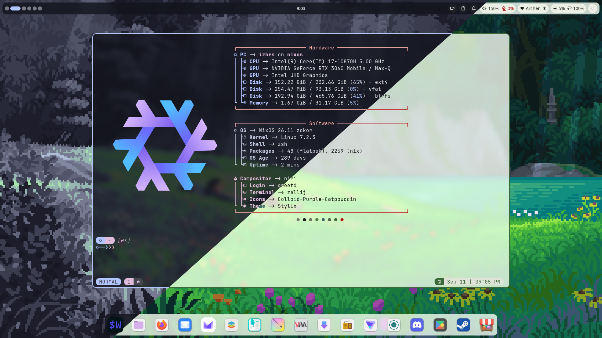

<details>
  <summary>More Screenshots</summary>

### Light and Dark

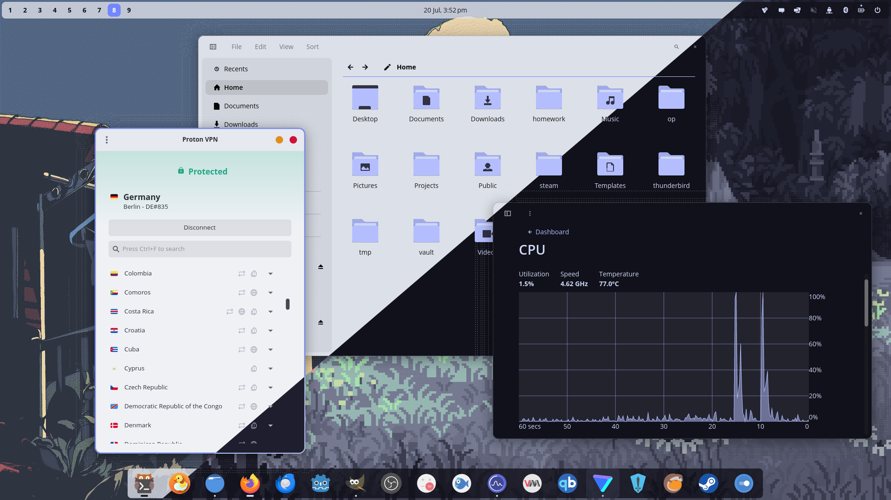

### Zellij

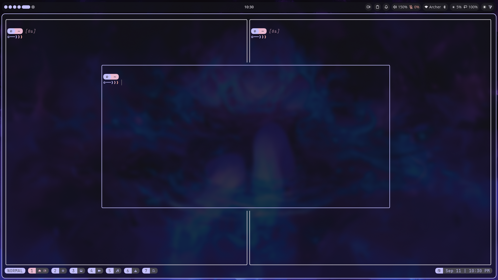

### Helix with Yazi

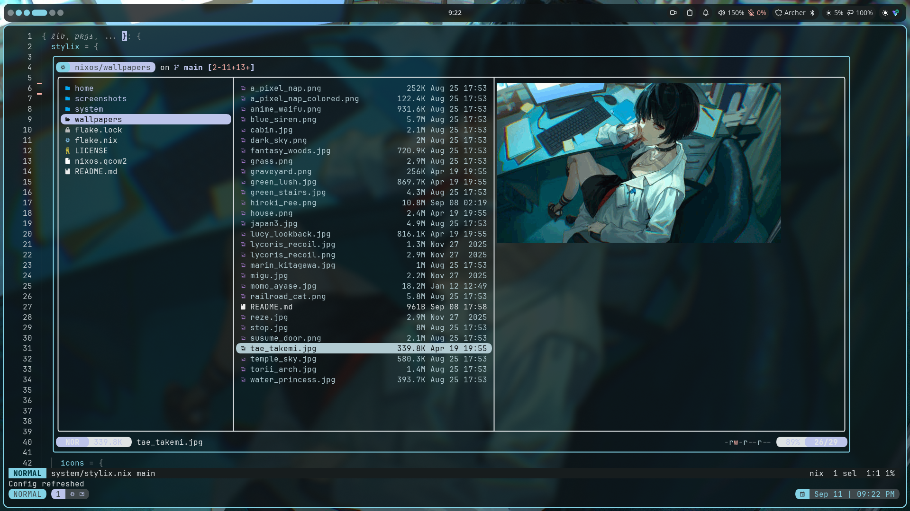

### Helix with Lazygit

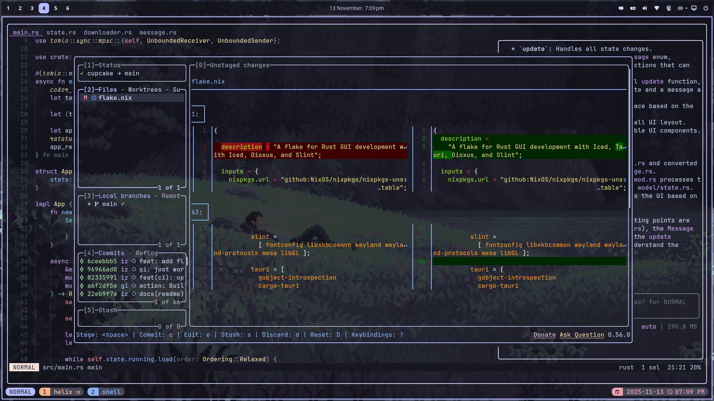

### Helix

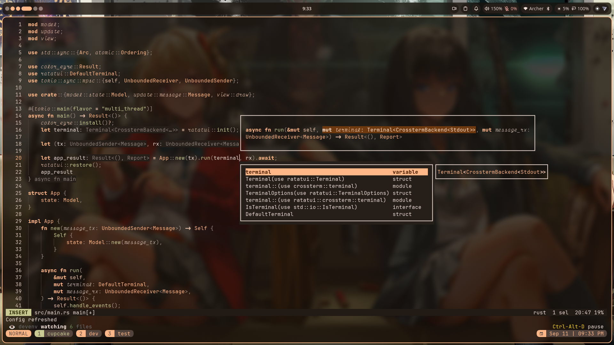

### Helix with Gemini

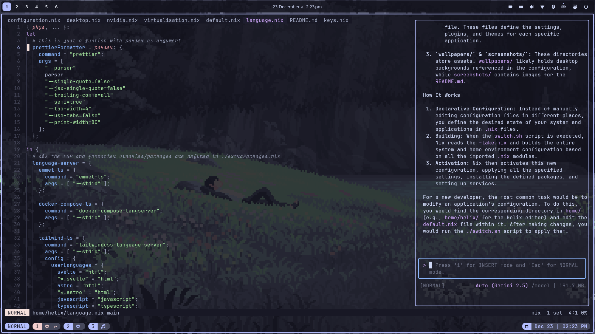

### Tiles

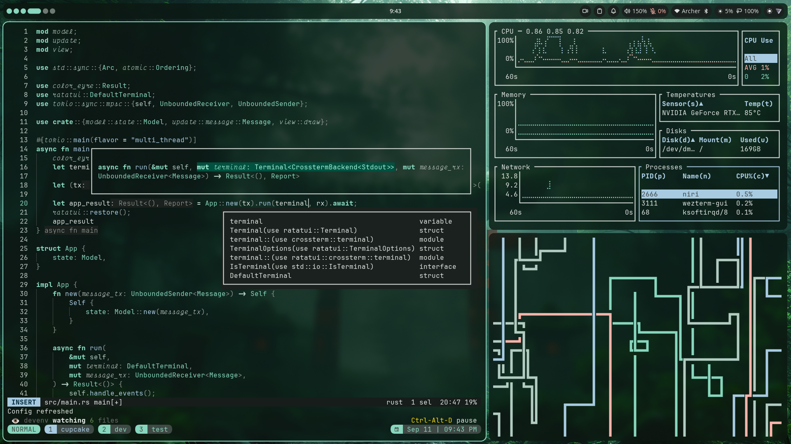

### Bottom

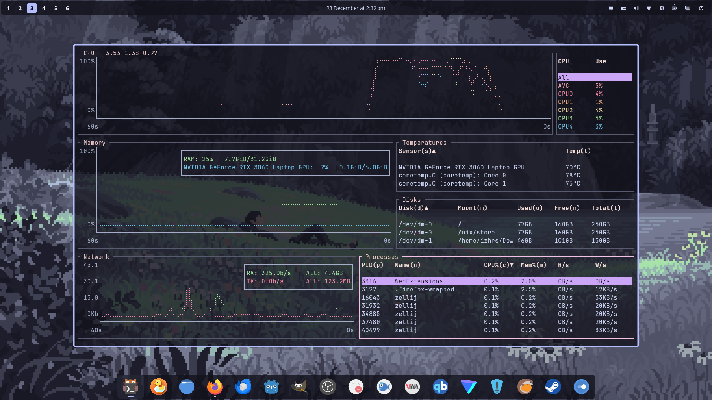

### Cosmic Files and Nautilus

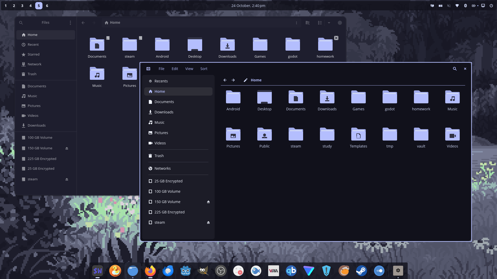

### Firefox

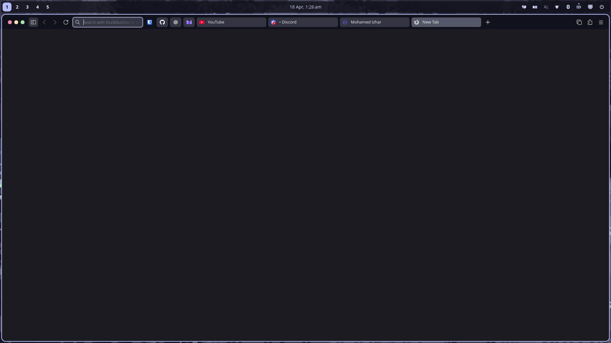

### Firefox with vertical tabs

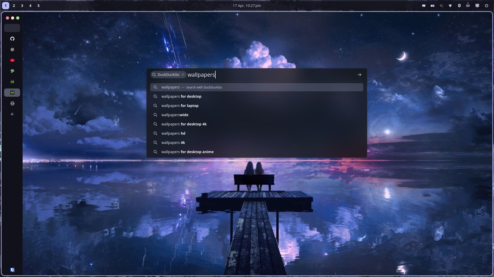

### Nwg-drawer

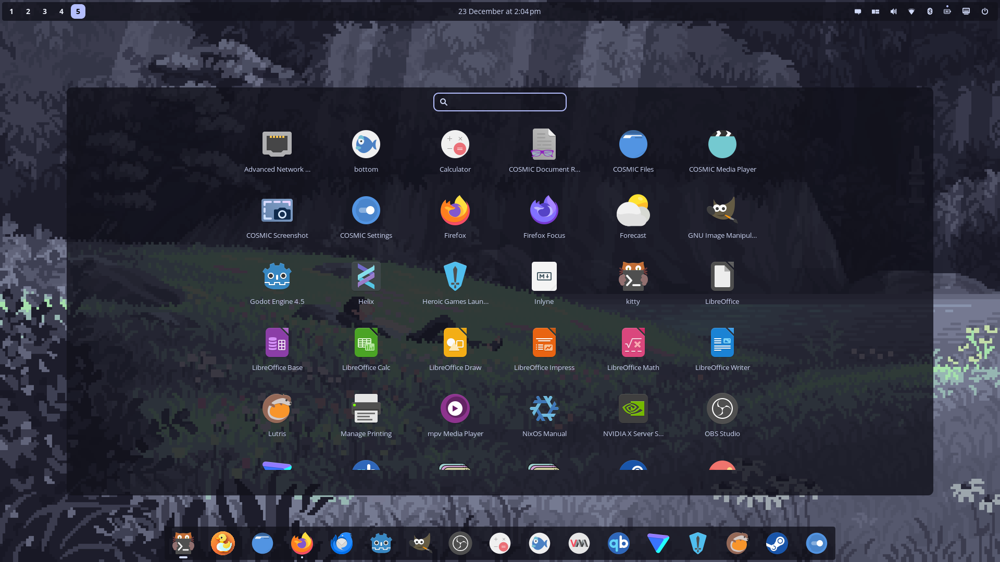

### Rofi

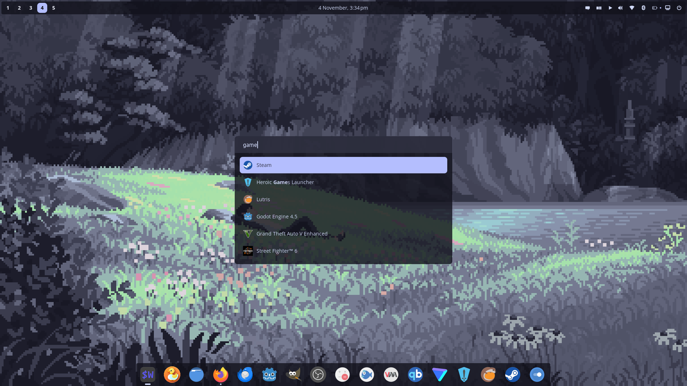

</details>

## Project Structure

> [!note]
> This configuration is built for my personal use. I don't intend for others to use it as-is, and making it portable or beginner-friendly is not a goal of this dotfiles. There is no setup script. That said, the code is structured so that individual program configurations are easy to lift out. Each program lives in its own directory and is self-contained, it only relies on flake inputs and Stylix. The use of Home Manager as a NixOS module is purely for integration (with stylix) convenience. I highly recommend setting up [Stylix](https://github.com/nix-community/stylix).

```.
├── home/
│   ├── default.nix        # User environment vars, xdg default appliations and module inports
│   ├── cosmic/            # Cosmic DE config (not nixified)
│   ├── helix/             # Helix editor config
│   ├── yazi/              # Yazi terminal file manager config
│   ├── zellij/            # Zellij TUI multiplexer config
│   └── ...                # Other Home Manager modules
├── system/                # System-level NixOS config
│   ├── configuration.nix
│   ├── desktop.nix
│   ├── virtualisation.nix
│   └── ...
├── flake.nix              # all flake inputs and home-manager config
├── README.md
└── ...
```

## Home Manager

This configuration uses Home Manager as a Nix module (instead of running a standalone home-manager CLI setup). Home Manager declaratively manages the user environment: packages, dotfiles, and user services in a reproducible way.

## Light Mode

Light theming is implemented using NixOS specialisations, which allow per-program theme overrides to be declared alongside their default (dark) configuration and activated at runtime without rebuilding.

Most programs are themed via [Stylix](https://github.com/nix-community/stylix). The “system-level” Stylix configuration is still used for the majority of styling (fonts, opacity, etc.), but in Home Manager we override only the theme image/color inputs so that Stylix stops inheriting colors from the system config. This enables Home Manager specialisations to switch between dark and light Stylix specialisations without requiring root (system specialisation activation would need sudo, whereas Home Manager does not).

Theme switching is handled by the specialisation activation script, which applies the corresponding light/dark Stylix settings atomically across the configured programs (GTK theme, terminal colors, editor theme, wallpaper, and other program-specific configurations). There's also 2 desktop shortucts to activate themes from application launchers.

## Helix as IDE

This setup features deep integration of Helix with Zellij, Yazi, and Lazygit:

- **Helix**: The ~~post modern~~ _stable_ editor whose plugins don’t crash every other day because it doesn’t need 50 of them (or any) to be useful in the first place. All language configurations are managed in `home/helix/language.nix` for:
    - Rust, C, C++, Nix, Lua, Typst, Python, Bash, Dockerfile, Docker Compose, JavaScript, TypeScript, JSX, TSX, JSON, YAML, Markdown, HTML, CSS, SCSS, Svelte, TOML, PowerShell
    - Most of the language is configured with formatters and language servers.
- **Yazi**: Integrated as a file picker within Helix.
- **Lazygit**: Integrated as the Git UI inside Helix.
- **Zellij**: tHe InTEgRRattion: Used to open Yazi and Lazygit in floating panes, making them appear as native Helix popups for a unified workflow.

Yazi and Lazygit are launched in context aware floating panes via Zellij, making them feel like native extensions of Helix. This tight integration allows seamless file navigation and Git operations without ever leaving the editor environment.

## Credits & Acknowledgments

This configuration is built upon the excellent work of the following projects and their maintainers:

**[NixOS](https://nixos.org/)** - The Nix Operating System that enables reproducible and declarative system configurations.

**[Cosmic DE](https://system76.com/cosmic)** - Customizable, and performant desktop environment built from scratch using Rust and the Iced toolkit.

**[Home Manager](https://github.com/nix-community/home-manager)** - Nix-based user environment configurator by the nix-community, enabling declarative management of user packages and dotfiles.

**[Stylix](https://github.com/nix-community/stylix)** - Declarative theming for NixOS and Home Manager, generating consistent colors, fonts, and UI styling across entire OS.

**[Helix](https://helix-editor.com/)** - The ~~post modern~~ _stable_ editor whose plugins don’t crash every other day because it doesn’t need 50 of them (or any) to be useful in the first place.

**[Zellij](https://zellij.dev/)** - A terminal workspace with batteries included.

**[Yazi](https://github.com/sxyazi/yazi)** - Blazing fast terminal file manager by sxyazi, written in Rust with async I/O.

**[Kitty](https://github.com/kovidgoyal/kitty)** - A fast, feature-rich, GPU-based terminal emulator.

**[Rofi](https://github.com/davatorium/rofi)** - An application launcher and dmenu replacement.

**[Nwg-drawer](https://github.com/nwg-piotr/nwg-drawer)** - A GTK3-based application drawer for wlroots-based Wayland compositors. However this works in my smithay based COSMIC de rather well.

**[Catppuccin](https://github.com/catppuccin/catppuccin)** - Soothing pastel theme ecosystem maintained by the Catppuccin organization, providing consistent theming across multiple applications.

**[Starship](https://starship.rs/)** - Cross-shell prompt by the Starship contributors, providing a fast and customizable command line prompt.

**[LazyGit](https://github.com/jesseduffield/lazygit)** - Simple terminal UI for git commands by jesseduffield, providing an intuitive interface for Git operations.

**[Delta](https://github.com/dandavison/delta)** - Syntax-highlighting pager for git by dandavison, enhancing git diff output with beautiful formatting.

**[Zsh](https://www.zsh.org/)** – A fast, POSIX-compatible shell with sane scripting, proper interactivity, and plugin support that doesn’t fight you. No structured data fantasies, just a shell that gets out of the way and gets shit done.

## License

This project is licensed under MIT license

## Contributing

Feel free to open issues or submit pull requests if you have suggestions for improvements.
